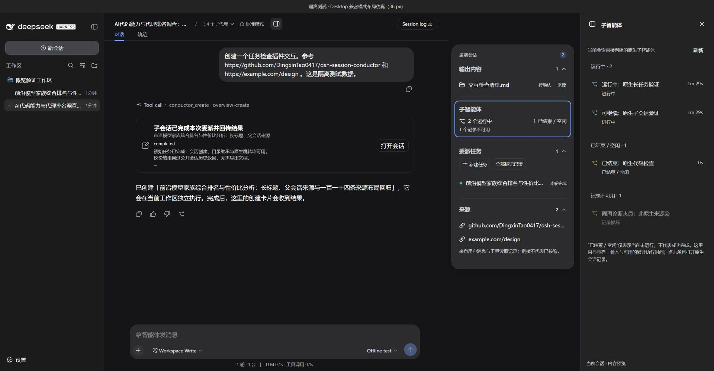
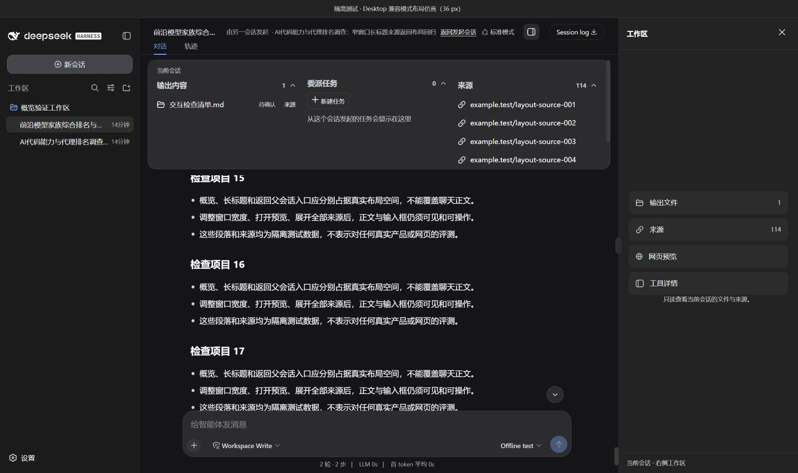
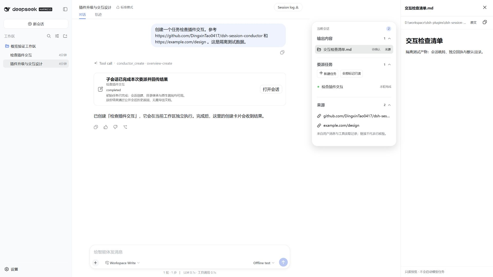

[简体中文](README.md) | [English](README.en.md)

# DSH Session Conductor

面向 DeepSeek Harness Desktop 的原生多会话协调插件。在普通对话中创建聚焦的子会话，通过聊天内卡片双向跳转，在常驻的**会话概览卡**中查看输出内容、原生子智能体、委派任务和来源，并点击资源在原生右侧栏预览。

子会话默认继承父会话工作区，标题由父会话决定。创建后父会话停止本次协调；子会话完成时回传结果，后续追加指令也有独立回执。默认不会唤醒父模型或重复验证，持续监控由用户明确开启。

**当前版本：0.2.6 本地开发候选。** 侧栏开关位于 `Session log` 右侧；空间不足时沿用概览顶部的可达回退入口。概览卡在主会话内容流中宽屏右对齐，主聊天滚动区保留完整宽度，滚动条位于主界面最右侧。打开侧栏后默认约 70% 工作区 / 30% 聊天（排除左侧导航），打开时隐藏概览，关闭后恢复；宽屏可拖动或用键盘调整比例，窄屏转为避开 Desktop 顶栏的全宽抽屉。当前已通过源码 typecheck、构建、97 个测试文件 / 1,407 项测试、lint、smoke 及隔离 Desktop Host/browser 布局验证；0.2.6 候选包与本机 `desktop` Profile 安装、回滚记录见 [Desktop 试用记录](docs/DESKTOP-TRYOUT.md)。须完整退出 Desktop（含托盘进程）并正常重开，才能加载新版 Host；用户窗口的实际重开加载仍待确认。未发布到 npm。

## 能力概览

| 能力 | 行为 |
| --- | --- |
| 原生会话跳转 | 聊天内创建卡片打开子会话；子会话标题栏返回发起会话。 |
| 会话概览卡 | 默认常驻显示，没有关闭按钮；Escape 或点击外部不会关闭。资源整行可点击，悬停或键盘聚焦时整行高亮。 |
| 原生子智能体概览 | 与 Conductor 的“委派任务”独立，只显示当前会话直系宿主子智能体；“运行中”“已结束 / 空闲”和“记录不可用”均是状态，不代表成功完成。 |
| 子智能体目录 | 点击概览入口在右侧打开分组列表；健康条目整行打开对应原生会话，不可用记录保留原因且不能跳转。每组先显示 10 条，之后每次增加 30 条。 |
| 独立侧栏入口 | 会话标题栏右侧按钮直接打开或关闭侧栏；空间很窄时入口移到概览卡顶部。关闭侧栏不关闭概览。 |
| 右侧内容预览 | 点击“输出内容”或“来源”标题打开资源集合；点击文件、图片附件或网页在宿主原生右侧栏预览。 |
| Codex 类工作区布局 | 自有侧栏默认占会话可用区域约 70%，聊天约 30%；聊天/工作区最小宽度分别为 320/300 CSS px。分隔条支持拖动、方向键和 Home 复位，手动比例会记忆；窄屏使用避开顶部栏的抽屉。 |
| 概览层级 | 自有工作区或资源预览打开时隐藏概览卡，关闭后恢复；宿主原生工具详情按实际可见性隐藏概览，关闭后恢复。 |
| 独立委派回执 | 首次与追加指令分别保存结果、未读状态和准确轮次；查看本次公开结果不推进模型历史游标。 |
| 直接操作 | 模板创建、补充指令、排到下一轮、精确停止本轮、显式监控开关。 |
| 环境选择 | 默认沿用主会话工作区；可明确从当前提交创建 worktree，相关运行任务共享目录时提示。 |
| 默认委派即止 | 创建或分叉成功后，父会话只呈现结果并停止，不会重复、验证、汇总或监控子任务，除非用户明确要求。 |
| 一次性完成回传 | 带非空首条指令的子会话可在其准确首轮委派结束后，仅向原创建卡片回传一次终态结果；不会创建父会话模型轮次。 |
| 已授权进度读取 | 用户要求查看进度时，父会话可直接读取已授权子会话的公开历史，无须要求子会话额外写报告文件。 |
| 工作区与标题继承 | 新任务默认使用发起会话当前工作区，子会话标题由发起会话指定。 |
| 受控协调 | 支持加入、分叉、补充、排队、撤回未消费输入、停止、转交、定时计划、工作流、约束和预算计量。 |

## 使用体验

点击概览中的“子智能体”，即可查看运行中、已结束 / 空闲及不可用记录；点击条目进入原生子会话。



点击会话标题栏的侧栏图标即可打开“工作区”首页，无须先选择文件。首页提供输出文件、来源、网页预览、终端、工具详情；预览工具栏可返回首页。它不启动模型任务。终端在当前会话工作区目录启动 Host 提供的真实 shell。

概览中的“子智能体”入口打开当前会话的原生直系目录。列表将运行中、已结束 / 空闲和不可用记录分开显示；累计时间只取宿主正式 `subagentTiming` 投影，缺失时不猜测。点击前再次核验目录归属，再以原生 `openSubagent` 打开会话。



1. 在当前会话中要求创建任务，并给出标题和首条指令。
2. 通过聊天内创建卡片打开子会话。
3. 通过子会话标题栏返回发起会话。
4. 子会话首轮委派结束时，原创建卡片可显示一次受限的终态结果和公开预览。
5. 在常驻概览卡中查看相关文件、原生子智能体、来源和未读回执；点击子智能体入口打开右侧目录，点击资源打开右侧预览，也可直接读取本次结果或追加指令。
6. 只有明确要求持续跟进时，才启用监控。

原创建卡片只保留首次结果；后续指令的结果出现在概览卡中。回执表示该轮结束，不表示任务已验收。



文本预览支持 UTF-8 文本、代码和常用 Markdown 结构，可切换原文；文件上限 512 KiB，显示最多 200,000 个 UTF-16 代码单元并提示截断。图片附件通过宿主正式接口读取。网页预览提供地址栏、刷新、会话内前进/后退和外部打开；仍是受限 iframe，站点禁止嵌入时无法绕过，也不是完整内置浏览器。

宽屏概览卡在主会话内容流中右对齐；聊天滚动区保留完整宽度，滚动条位于主界面右侧。会话可用宽度不足 1080px 时，概览在标题栏之后按实际高度占位，来源较多时在卡片内滚动。打开自有工作区后，工作区约占 70%、聊天约占 30%，并按 320/300 CSS px 最小宽度约束；这是一块插件自有 surface，不是对宿主原生详情栏宽度的设置。布局兼容 Desktop 自带标题栏，不覆盖正文；极窄窗口的工作区抽屉也避开标题栏。历史会话可经正式元数据接口取得只读概览与文件预览凭据，无须恢复 Agent；协调写入仍要求活动 Agent。

侧边聊天、完整文件树和 Git 工作树审查尚未接入；“工具详情”恢复宿主原有详情内容，不等同于独立开发工具。终端依赖 Host 的 `spawnTerminal`，缺能力时会说明原因。

当前三个模板为只读调研、实现功能和检查变更。一次性自动汇总、自定义模板、跨会话通知汇总与更完整的开发工具入口属于后续阶段，详见 [概览规格与路线图](docs/CONVERSATION-OVERVIEW.md)。

## 边界与安全

- 父子关系通过稳定的 Task、Binding 和 Operation 身份保存，不依赖标题或文本猜测。
- 回传需要原父会话、仍有效的读取权限、准确首条 relay/轮次关系，以及每张卡片的私有 capability；capability 不进入 URL 或渲染后的聊天正文。
- 概览和直接结果读取使用同源、仅限本机的 UserUI 凭据；读取前后复查授权，已读确认与模型游标分开。
- 原生子智能体概览只读取正式 `sessions.list` 目录并按需调用 `refreshSubagents(parentId)`；它不读取目标历史、私有缓存或 Session 日志，不恢复 Agent，不启动模型、发送消息或安排模型监控。健康条目在再次核验 `parentSessionId + childSessionId + mode` 后才调用原生 `openSubagent`；缺能力时明确提示，不回退猜测普通会话路由。`inactive` 与 `SessionSummary.completed` 未读提醒均不能被解释为成功。
- 文件预览另行验证当前会话或已授权本机子会话的工作区、规范路径和文件身份；越界、二进制、超限或读取期间权限变更都会拒绝，不启动模型。
- 仅有限长度的公开 user/assistant 内容可作为预览。推理、token chunk、私有会话数据和原始 Session 日志均被排除。
- Task 被 release 后，未终态回传不再继续观察；已持久化的终态只会在原父仍有读取权限时显示。
- 远程路由和 HTTPS 分享默认关闭；安装不会启动远程或分享服务。

## 兼容性与配套包

本仓库只包含主插件。部分能力需要独立交付的配套包：

- `dsh-harness-compat@0.1.1` 在 Desktop 2.0.10 上以 overlay 提供隔离模型设置和原生 fork 目标参数；不要再安装面向 `dsh-host-apiproxy` 的 0.1.0。
- `dsh-binary-files@0.1.1` 为 fs `0.1.5-rc.2` 提供受保护的二进制文件写入能力。

当 Host 缺少某项能力时，插件会明确拒绝受影响的操作，不会静默改变语义。它不会改写已安装的 Desktop ASAR。

## 开发快速开始

要求：Node.js `^22.19.0 || >=24.0.0`，以及兼容的 DeepSeek Harness 开发环境。

```sh
npm install
npm run check
npm run lint
npm run smoke
```

`npm run check` 会检查源码和测试类型、构建 Host/client/配套入口，并运行 Vitest。本项目尚未发布到 npm。本地 Desktop Profile 安装流程有严格环境约束；在另一台机器适配前，请先阅读 [OPERATIONS](docs/OPERATIONS.md)。

## 项目结构

```text
src/          Host 服务、协调领域、存储、工具和原生聊天 UI
companions/   配套桥接入口
tests/        单元、集成、生命周期和回归测试
docs/         PRD、API、运维、验收、兼容性和演示文档
scripts/      构建 smoke 检查与受保护的本地验证工具
```

## 验证状态

`0.2.3` 的测试和安装记录、`0.2.4 / T44` 的原生子智能体记录均保留在 [ACCEPTANCE](docs/ACCEPTANCE.md)；它们不替代当前 0.2.6 的证据。当前 0.2.6 已完成源码检查、隔离 Host/browser 验证、候选包封存和本机 Profile 离线安装；用户 Desktop 完整退出并重新打开后的实际加载仍待确认。隔离验证不会调用外部模型或修改正式会话。

## 概览接口出现 HTTP 404

本轮问题已定位为：旧 Host 进程的启动时间早于 `0.2.0` 安装，前端刷新后加载了新版概览，但旧进程没有对应接口。**仅刷新页面不够，须完整退出 Desktop（包括托盘）后正常重开。** 新版会明确提示接口版本不一致和重启操作；不要因此删除会话或改写 ASAR。具体文件不存在则显示文件错误，不应与接口缺失混淆。

## 文档导航

| 文档 | 用途 |
| --- | --- |
| [PRD](docs/PRD.md) | 产品行为、默认值、架构和验收标准 |
| [IMPLEMENTATION](docs/IMPLEMENTATION.md) | PRD 与代码/测试对照、里程碑状态 |
| [OPERATIONS](docs/OPERATIONS.md) | 本地配置、运行、恢复和卸载说明 |
| [API](docs/API.md) | 工具、路由、状态、存储和生命周期约定 |
| [NATIVE-LINKS](docs/NATIVE-LINKS.md) | 父子会话跳转和完成卡片边界 |
| [CONVERSATION-OVERVIEW](docs/CONVERSATION-OVERVIEW.md) | 概览卡、原生子智能体目录、独立回执、接口与升级路线 |
| [设计验收](design-qa.md) | 参考图、实机截图、交互和视觉验证 |
| [ACCEPTANCE](docs/ACCEPTANCE.md) | 验证证据、产物和已知缺口 |
| [DEMO](docs/DEMO.md) | 已核对的工具参数示例 |
| [兼容记录](docs/compatibility.md) | 实测 Host/运行时兼容性说明 |
| [协作约定](AGENTS.md) | 实施与协作规则 |

## 状态

项目处于活跃的本地开发阶段，尚未发布到 npm、未公开部署，也尚未声明许可证。
