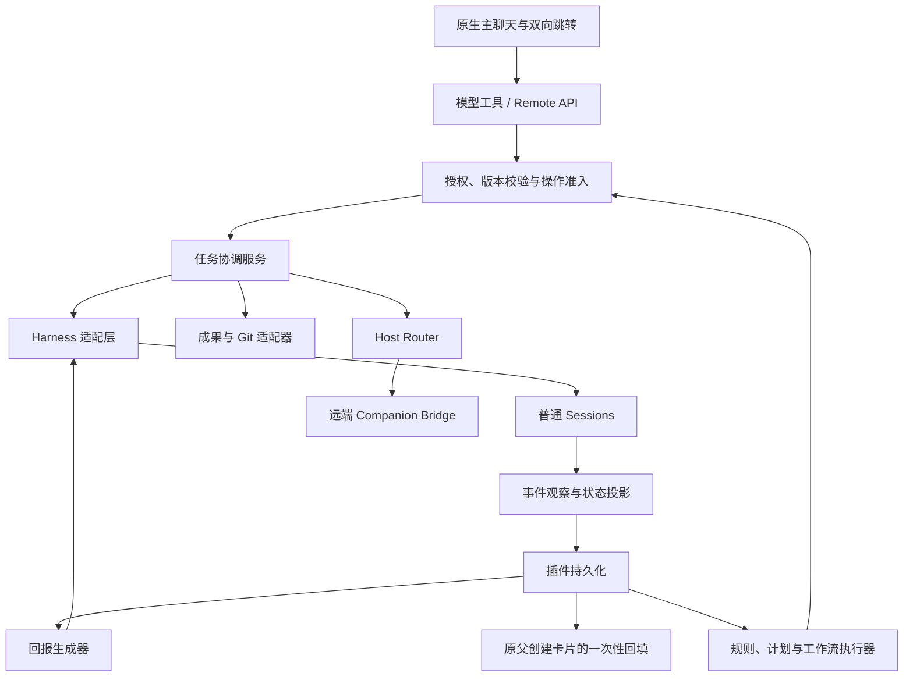

# DeepSeek Harness 多会话协调插件 PRD 与开发规格

**文档版本：2.11**
**暂定产品名称：DSH Session Conductor**<br>
**状态：产品与开发规格；实际实现与验证范围见 ACCEPTANCE.md**<br>
**日期：2026-09-15**

本版完整替代此前版本，纳入跨会话能力差距、可靠性修正和进阶功能。全部功能进入产品范围，按三个阶段交付。

以下 2.1—2.10 保留当时的修订与验证记录。当前交互以 2.11 / T46、T45、T44、T43、T42 及其补充为准，旧版概览的默认收起和关闭行为不再适用；历史验证结论不自动继承为后续候选版本的结论。

2.9 对应 `0.2.4`，增加 T44 原生子智能体概览和右侧分组列表。它与 Conductor 独立“委派任务”分区并存，仅展示当前会话的直系原生子智能体。数据来自正式 `sessions.list` 与 `refreshSubagents(parentId)` 目录，不读取私有缓存或自动拉取子历史。按真实 activity 分“运行中”“已结束 / 空闲”，损坏或不可用记录单列；`inactive` 不代表成功完成，`SessionSummary.completed` 仅是未读提醒，禁止作为成功依据。点击条目核验最新目录后用准确 parent/child/mode 的 `openSubagent` 原生地址打开历史；列表本身不启动模型、不发送指令或创建监控。实现、真实 Host/browser 和本机安装分别记录在 ACCEPTANCE 与 DESKTOP-TRYOUT。

2.10 对应 `0.2.5`，落实用户对 Codex 类工作区比例和概览层级的要求。右上角独立侧栏打开后由插件自有工作区 surface 承担可用会话区域（不含左侧导航）的默认约 70%，聊天区域保留约 30%；实际宽度受聊天至少 320 CSS px、工作区至少 300 CSS px 约束。宽屏支持分隔条拖动、左右方向键和 Home 恢复 70%，手动比例按本机浏览器偏好保存；可用宽度小于 740 CSS px 时切换为避开 Desktop 顶栏的全宽抽屉。打开自有工作区或资源预览时隐藏概览卡，关闭后恢复；打开宿主原生工具详情时也按实际详情栏可见性隐藏概览，关闭后恢复。原生 `details` 的宿主宽度仍由 Host 管理（Desktop 2.0.3 已验证范围为 300—520 CSS px），插件不伪造未公开的宽度设置接口。自有 surface 从公共 header additive 插槽锚定，卸载、切会话及资源切换都清理其 DOM、监听器、注册和占位。T45 的源码测试、隔离 Desktop Host/browser QA、候选包和 Profile 安装分别记录，未完成的环节不得沿用 0.2.4 结论。

2.11 对应 `0.2.6`，修正 Codex 类工作区的标题栏位置和概览卡的主界面归属。可见侧栏开关注入宿主公开的 `conversation.session.header.utilities` 插槽并使用高顺序，必须紧跟 `Session log`；插件自有 `WorkspacePreview` 的零尺寸锚点继续留在 `conversation.session.header.actions`，避免占用标题栏按钮位置。长标题或窄窗口把标题栏入口挤出会话可视边界时，只显示概览卡顶部的同一回退入口，不同时显示两个开关。宽屏概览卡不再使用绝对定位或为其预留右侧 padding，而是在主会话 owner 的正常文档流中靠右占位；聊天滚动区保持完整会话宽度，滚动条位于主界面右侧。窄屏仍在 header 后按实际高度占位；打开插件工作区或资源预览隐藏概览并释放其占位，关闭恢复。新增 T46；必须同时验证真实 Host 的插槽顺序、1920/1280/390 CSS px 的滚动与缩放、侧栏开关及概览隐藏/恢复，且不修改 ASAR 或宿主私有布局状态。

2.1 按用户 2026-09-15 的交互要求修订：移除管理面板作为产品入口，改为主聊天中的创建卡片及目标会话中的来源返回链接。其余功能、接口原则、业务数据、授权边界与默认值沿用 2.0；增加 T33 验收。2.0 的面板布局和独立详情输入框不再是当前交付要求。

2.2 按用户同日补充要求修订默认创建环境与命名：省略目录和 Git 起点的新建/分叉任务，使用发起主会话的实际 cwd，并加入其已有 workspace；名称在主会话决定，同步为显式宿主标题，禁止首条消息自动命名覆盖。新增 T34。仅更新上述默认行为；显式目录、Git 起点及隔离 worktree 能力保留。

2.3 按用户同日补充要求修订跨会话进度读取：已授权目标会话的公开持久历史是了解进度和结果的首选操作路径。`conductor_read({view:"history"})` 必须把可读记录正文呈现给发起会话，不能仅返回“有几条记录”的摘要，也不能为了读取进度要求目标另写 Markdown、报告或其他文件。`brief` 只用于明确的上下文交接，`export` 只用于明确要求的交付物导出。新增 T35；实现和实机验证状态以 ACCEPTANCE 为准。

2.4 按用户同日补充要求修订创建后的默认委派边界：主会话成功创建或分叉目标后，默认只呈现创建结果和跳转入口并结束本次协调，不与目标重复执行同一工作，也不自动读取、等待、监控、发送、停止、汇总、比较、复核或验证。只有用户在**当前请求**中明确要求主会话参与、并行、监控、汇总、比较、复核或验证时，才执行该明确范围内的后续动作。新增 T36；它已在本地 `0.1.5` 实现并通过 `npm run check`（79 个测试文件 / 1,200 项测试）、lint、smoke、干净包真实 Host/Edge 4 场景和官方离线 CLI 的 `desktop` Profile 链接验证。当前运行中的 Desktop 仍需完整退出（含托盘）并重新打开，用户重启确认待完成；完整证据见 ACCEPTANCE。`0.1.4` 不包含此规则。

2.5 按用户同日补充要求新增首轮结束的一次性回传：仅创建或分叉带有**非空** `instruction`（字符串长度大于 0）时，准确 relay 的消息 ID 持久化后才 arm；插件只跟踪承载该消息的**准确首轮**。该轮或初始投递进入终态后，只更新原始父会话中已有的创建卡片，非终态不显示。它不唤醒父会话模型、不产生父会话消息，也不自动 `read`、`wait`、`watch`、`send`、`stop`、汇总、验证或重复目标工作。用户若在**当前请求**中明确要求持续监控，才使用既有 `watch`。T37 是当前 `0.1.6` 源码候选行为，最终完整验证、干净包、Host/Edge、Profile 和 Desktop 证据待完成；不得把 `0.1.5` 的任何证据写成 T37 已通过。

---

2.6 按用户对完整截图的澄清新增**会话概览卡**，它是聊天右上方按需展开的轻量卡片，默认收起；不是独立管理工作台。“会话概览卡”为本项目描述性名称，不宣称是 Codex 正式术语。保留 T33 的聊天内创建卡片和来源返回链接，T36 的默认委派即止保持有效。新增 T38—T41：三分区概览、每次追加委派的独立回执、显式用户操作和共享目录提醒。详细字段、HTTP 契约、默认值、上限、权限与分阶段路线见 [会话概览卡开发规格](CONVERSATION-OVERVIEW.md)，该文档为本版规范组成部分。

2.6 的窄例外增加为 T37 + T39：后台可以无模型地对账准确的首次或后续已发送指令，投影只读回执；不得由此启动父模型、修改其历史游标或自动进行验证。概览中的新建/补充/停止/监控按钮属于显式 UserUI 操作，复用已有服务授权；默认模式不启用监控。T37 原始创建卡片仍只显示其首次终态，后续指令不会覆盖它。一次性父模型自动汇总、自定义模板和跨会话通知汇总进入后续范围，0.2.0 不宣称已实现。

2.7 按用户最新截图修订概览与预览体验，对应 `0.2.1`：概览默认常驻，不提供关闭按钮，Escape 和外部点击不能关闭；资源整行可点击并在悬停/聚焦时变灰。点击“输出内容”“来源”标题打开集合，点击资源在宿主原生右侧 `details` 栏预览，关闭预览不关闭概览。T42 覆盖 T38 中此前的收起/关闭条款，其他既有验收与 T36 默认委派即止保持有效。

本版文件预览通过 UserUI token 与工作区规范路径授权，仅支持有大小上限的 UTF-8 文本、Markdown 与代码，不启动模型；图片附件使用正式 `readAttachment` 接口，网页使用受嵌入限制的 iframe 并提供外部浏览器入口。预览临时占用原生右侧栏，关闭、切换会话及卸载恢复官方工具详情注册；宿主未公开工具详情选择订阅，不能承诺自动联动。它不等同于完整侧边聊天、文件编辑器、Git 审查或内置浏览器。工作区终端是 Host PTY，默认在当前会话工作区目录启动。完整约定见 [概览与右侧预览规格](CONVERSATION-OVERVIEW.md)。

历史候选 `0.2.1` 已通过源码、90文件/1,314项测试与真实Host/browser验证；本机安装和窗口加载状态见 DESKTOP-TRYOUT.md。此前概览接口 HTTP 404 已定位为旧 Host 进程启动早于 `0.2.0` 安装、前端刷新后加载了新版；错误提示须引导完整退出 Desktop（包括托盘）并正常重开。不得以历史测试数字或已更新的前端推断当前 Host 已升级。

`0.2.2` 在 2.7 / T42 内补充窄窗布局和冷持久会话读取，不提升 PRD 版本：会话容器不足 1080 CSS px 时，概览在 header 之后参与正常文档流并按实际高度占位，不能遮挡正文；宽屏保留右侧卡片。布局须兼容 Desktop 的 36 px 顶栏及 transformed 内容容器，不能混用视口与 fixed 包含块坐标。已持久化但无 live Agent 的会话可经正式元数据取得只读 bootstrap 与文件预览，不恢复 Agent；协调写仍需 live Agent 和既有授权。此候选已通过 91 文件 / 1,339 项测试、lint、smoke、带 Desktop 容器的隔离布局回归、真实 Host 冷会话 HTTP 验证及本机 Profile 安装，证据独立记录于 ACCEPTANCE 与 DESKTOP-TRYOUT。用户原生窗口重开确认仍待完成，不能沿用上段 `0.2.1` 验证结论。

2.8 对应 `0.2.3`，新增 T43 的右上角独立侧栏开关和侧栏首页（`WorkspaceHome`）。未选中文件时也可显式打开首页。首页入口为当前会话输出文件、来源、网页 URL 表单、会话工作区目录启动的 Host PTY 终端，以及恢复官方工具详情。首页和内容预览均可临时占用原生 `details`，任何资源预览可返回首页；关闭侧栏不关闭常驻概览，切会话或卸载清理注册与状态。这些操作不启动模型或协调写。侧边聊天、Git 审查、完整文件树和 `fileReferences` 搜索未接入，不显示假入口。最终 QA、候选包与安装验证尚待完成，不沿用历史版本的验证结论；详细规范见 [概览与侧栏首页规格](CONVERSATION-OVERVIEW.md)。

## 一、产品定义、范围与技术基线

### 1. 产品目标

用户在一个主会话中，通过自然语言、聊天内回执和双向会话跳转完成：

- 创建、分叉、发现和整理其他会话。
- 查看进展、追加指令、排队、停止和续跑。
- 接收完成、失败、需要介入等通知。
- 继承必要上下文，交接文档、文件和代码修改。
- 更换执行环境，转交任务控制权。
- 执行事先授权的定时任务、依赖流程和有限返工。
- 查看成果、验收证据、执行记录和用量。

典型指令：

> “创建一个会话设计接口，另一个会话实现前端。接口文档验收通过后交给前端；前端完成后让测试会话检查。失败最多返工两轮，最后向我汇报。”

产品的默认工作方式保持为：**执行用户当前指令，以及用户事先明确授权的有限规则。**

模型输出、任务结果和自动通知不能自行扩大任务目标、权限或预算。

成功创建或分叉一个目标会话后，主会话的默认职责到创建结果为止：显示实际标题、状态和可用跳转，不执行目标已承担的同一工作，也不自行触发 `read`、`wait`、`watch`、`send`、`stop` 或验收。创建请求中交给目标的首条指令仍由目标执行；这不授权主会话重做、检查或跟进该工作。T37 仅为带非空首条指令的创建／分叉保留一个无模型的一次性卡片更新：准确 relay 消息 ID 持久化后，它锚定承载该消息的首轮，且只在终态回填原父卡片一次；非终态不显示，不构成父会话参与或持续观察。只有用户在当前请求明确要求主会话参与、并行、监控、汇总、比较、复核或验证时，主会话才在所述范围内继续协调。历史 Grant、工具回执、目标输出或“任务已创建”本身均不是该例外。这是发起会话的编排行为约束，不取代 Host 的工具权限、用户原生输入或既有控制关系。

### 2. 核心概念

| 概念 | 定义 |
|---|---|
| 控制会话 | 用户用来安排、查看和协调任务的普通 Harness 会话 |
| 逻辑任务 `Task` | 插件管理的长期工作对象，具有稳定 `taskId` |
| 宿主会话 `Session` | Harness 实际保存聊天与执行历史的对象 |
| 执行绑定 `Binding` | 逻辑任务当前对应的 `hostId + sessionId` |
| 轮次 `Turn` | 宿主的一次执行轮次 |
| 操作 `Operation` | 一次创建、发送、停止、迁移等可追踪请求 |
| 成果 `Artifact` | 带来源与版本的文件、文档、代码差异、链接或验证结果 |
| 授权 `Grant` | 用户允许后台执行的目标、动作、触发条件及限制 |
| 工作流 `Workflow` | 用户定义的任务依赖、输入成果、验收和返工规则 |
| 一次性完成回传 `CompletionReturn` | 创建／分叉时首条 relay 消息、其 Binding 与该首轮结束状态的持久关联；只投影给原父会话既有创建卡片 |

**逻辑任务 ID 与 Session ID 分开。**

- 分叉产生新逻辑任务。
- 环境迁移保留逻辑任务 ID，可以创建后继 Session。
- 历史消息仍归属于原 Session，不改写其身份或目录。

本插件管理可独立存在的普通会话。工作流节点也使用普通会话，不承诺内部子代理的父子生命周期或自动上下文继承。

### 3. 用户角色与控制关系

| 角色 | 权限 |
|---|---|
| 用户 | 安排任务、授权规则、验收、调整配置和转交控制权 |
| 写控制者 | 在授权范围内向目标发送、停止、配置和调度 |
| 只读观察者 | 查看目标状态、历史和允许访问的成果 |
| 规则执行器 | 按已保存的授权执行固定动作 |
| 回报生成器 | 汇总事实和待介入事项，不自行派发新任务 |

一个逻辑任务同一时间只有一个插件写控制者，可以有多个只读观察者。

禁止控制自身。控制关系不得形成循环。目标会话原界面的用户输入始终保留，插件不取得排他的系统执行权。

### 4. 交付阶段

| 能力范围 | A：基础协调 | B：交接与调度 | C：受限工作流与扩展 |
|---|---:|---:|---:|
| 新建、加入已有会话、自然语言操作 | ✓ | | |
| 上下文交接、历史分叉 | ✓ | | |
| 异步准备与 ready 状态 | ✓ | | |
| 模型、推理强度、preset 配置 | ✓ | | |
| 实时监控、分页读取、增量等待 | ✓ | | |
| 创建首轮结束的一次性卡片回传 | ✓ | | |
| 发送、排队、精确停止、打断发送 | ✓ | | |
| 搜索、重命名、分组、置顶、归档恢复 | ✓ | | |
| worktree 与工作区起点选择 | ✓ | | |
| 成果清单、只读引用、本地导出 | ✓ | | |
| 观察权限与控制转交 | ✓ | | |
| 文件复制、patch 交接 | | ✓ | |
| 同 Host 环境迁移 | | ✓ | |
| 一次性联动、定时巡检、稍后续跑 | | ✓ | |
| 任务依赖图、验收、有限返工 | | | ✓ |
| 共享约束版本与影响追踪 | | | ✓ |
| 时间、次数、Token、费用策略 | | | ✓ |
| 跨 Host 管理与迁移 | | | ✓ |
| 在线分享快照 | | | ✓ |

跨 Host 和在线分享默认关闭。自动合并、提交、发布、购买资源不因启用插件而获得授权。

### 5. 技术核验基线与必要宿主改动

源码核验基线：

- 仓库：`deepseek-ai/deepseek-harness`
- 提交：`c291e7961a515f6d7af9304e7fd1d257929aef26`
- 源码版本：`0.1.5-rc.2`
- Node：`^22.19.0 || >=24.0.0`
- pnpm：`11.7.0`

以上为源码审阅结果，未验证对应 npm 包的完整内容或实际运行兼容性。[源码基线](https://github.com/deepseek-ai/deepseek-harness/blob/c291e7961a515f6d7af9304e7fd1d257929aef26/package.json)

宿主已有普通会话创建、读取、恢复、消息、取消和流式观察能力；Client 支持 Remote 和 UI 插件扩展。[会话接口](https://github.com/deepseek-ai/deepseek-harness/blob/c291e7961a515f6d7af9304e7fd1d257929aef26/packages/api/session-controller/src/types.ts)、[Client 架构](https://github.com/deepseek-ai/deepseek-harness/blob/c291e7961a515f6d7af9304e7fd1d257929aef26/docs/subsystems/web-client.md)

完整功能采用：**主体插件＋两项明确的 Host API 兼容扩展。**

| 扩展 | 原因 | 约定 |
|---|---|---|
| `selectModel.rememberAsDefault?: boolean` | 现有实现会尝试保存全局模型默认值 | 默认 `true` 保持原行为；插件固定传 `false` |
| `fork` 增加 `newSessionId?`、`workspaceId?`、`cwd?` | 原接口不能指定新会话身份及目标目录 | 复用原有会话组装；目录参数互斥；相同身份的重试必须核对来源、历史边界和目录 |

不得通过重复安装模型选择监听器、修改私有缓存或直接改写 Session 日志实现这些功能。[现有实现](https://github.com/deepseek-ai/deepseek-harness/blob/c291e7961a515f6d7af9304e7fd1d257929aef26/packages/api/session-controller/src/commands.ts)

兼容扩展单独提交、测试和版本化。未安装扩展时，相关功能显示不可用原因，不静默改变语义。

---

## 二、功能与交互规格

### 1. 自然语言入口与双向会话跳转

用户首次明确要求协调其他任务时，可以在同一操作中完成：

`启用控制会话 → 匹配目标 → 加入管理 → 执行指令`

不要求用户重复经过独立的启用和加入确认。目标存在实质歧义时，显示名称、目录和 ID 供选择。

使用宿主原生聊天与会话导航，不挂载浮动面板、侧栏管理器或独立控制台。

- **发起会话：** 用户指令、操作回执、自动回报。真实 `conductor_create` / `conductor_fork` 工具调用产生聊天内创建卡片，显示任务标题及“打开会话”。普通文字声称创建不能产生可用跳转。
- **创建状态：** 准备期间显示“正在创建会话”并禁用打开；准备完成且本地目标可用时显示“已创建会话”；失败、取消、远程目标或不可用会话显示原因，不错误跳转。
- **目标会话：** 在原生会话标题栏扩展位置显示“由另一会话发起”及“返回发起会话”；原会话可用时一键返回。保持原生用户输入、工具呈现与成果展示。
- **持久来源：** 从独立存储域的初始创建 Operation 和 Binding 读取关系，不依赖模型输出、浏览器选中项。控制权转交不改变最初来源；迁移后父卡片跟随当前 Binding，旧会话保留来源返回。T37 的每 operation 私有卡片 capability 与来源关系分开：它只授权原卡读取终态回传，不改变来源、控制权或导航。
- **恢复与隔离：** 刷新、重开、多个标签及多次创建不能串联到其他任务。不存在或不可用的源/目标禁用跳转，不创建替代会话、不发送消息。返回链接不自动授予控制权。
- **默认委派即止：** `conductor_create` 或 `conductor_fork` 成功完成准备后，发起会话只显示对应卡片、标题、状态和跳转入口，并结束本次创建后的协调。它不得自动重复目标的工作，也不得因为创建成功自动 `read`、`wait`、`watch`、`send`、`stop`、汇总、比较、复核或验证。用户在当前请求明确要求主会话参与、并行、监控、汇总、比较、复核或验证时，才执行所要求的后续步骤；未明确时，创建卡片不是进度检查或验收的触发器。

#### 1.1 创建首轮结束的一次性回传（T37，`0.1.6` 源码候选，最终验证待完成）

T37 是 T36 的窄范围、无模型卡片更新，不是后台 `watch`：

- **启用条件：** 仅真实 `conductor_create`／`conductor_fork` 且创建参数的 `instruction` 为非空字符串（长度大于 0）时启用。没有首条指令、空字符串、历史旧任务、`attach`、后来 `send` 的消息和无可信初始 relay 消息 ID 的任务都不补建回传。
- **精确范围与 arm：** `createMessage` 生成准确 relay `messageId` 后，先将 `operationId`、该 `messageId`、初始 `bindingId`／`bindingVersion` 及必填 `armedAt` 持久化为 `armed`，再允许后续派发。只接受该消息对应的公开 `user/message`，以及承载这条 relay 的首个委派 turn；宿主正常事件边界允许 `turn/start` 在 relay 前或后出现，终态必须严格取该 turn 的同一 `turn/end`。绑定变化、不同消息、不同轮次、迟到旧绑定或后续用户／插件消息都不能替代它。
- **仅终态卡片回填：** 只有 `returned` 或明确 `delivery_failed` 才向创建调用已经生成的、**原始父会话**既有创建卡片返回 `completion`。`armed`、`running`、`delivery_unknown` 等非终态只留在持久协调记录，不显示为卡片回传。首轮 completed 显示“子会话已完成本次委派并回传结果”；failed 显示“子会话本次委派未能完成”；interrupted 显示“子会话本次委派已中断”；blocked 显示“子会话本次委派已结束，需要处理”；初始投递明确失败显示“子会话初始指令未送达”。
- **文本边界：** `detail` 与 `reason` 在路由投影时各限 240 个 UTF-16 code units，`preview` 限 480 个 UTF-16 code units；超限使用 `… [truncated]` 标记且标记包含在上限内。预览仅为该准确首轮最后一条公开 assistant 消息；不显示 Think、推理草稿、raw token/chunk、私有 Session 文件、工具私有原始输出或后续轮次内容。点击仍只打开目标会话查看完整公开记录。
- **无父会话动作：** 回填不创建 user、relay 或 notice 消息，不唤醒、排队或继续父模型轮次，不消费 history／wait／report 游标，不调用 `conductor_read`、`conductor_wait`、`conductor_watch`、`conductor_send`、`conductor_stop`、摘要、成果验收或验证，也不自行创建后续任务。完成回传不是“整个任务已被用户验收”的声明，只说明被创建时委派的首轮已终态。
- **持续监控例外与节奏：** 用户在**当前请求**明确要求主会话持续监控、等待、汇总或处理后续状态时，才按所述范围调用 `watch`、`wait`、`read` 或其它工具。默认内部 pass 每 5 秒对账一次，原生可见卡每 1 秒轮询一次只读路由；两者都不唤醒父模型、不会消费 Watch，也不等于父会话持续监控。
- **访问、token 与恢复：** 终态投影同时要求请求来自原父会话、原父 `mayRead` 仍成立，以及该创建 operation 的私有 capability 正确。capability 是每 operation 的私有 43 字符 base64url 值，只在原工具结果的 `presentationMeta` 中供原生卡恢复，并仅随 `x-dsh-conductor-link-capability` header 发送；URL、查询参数、渲染的工具内容、聊天正文和卡片文本不得含 token。路由在投影边界还必须重新核对 callback 与当前 create/fork operation、task、relay `messageId`、非空 instruction、dispatch guard 的 bindingVersion 和准确初始 Binding 的关系；任一项不符时只保留导航，不返回 completion。原父 `mayRead` 失效（例如读取授权被撤销）后，创建／跳转关系仍可保留，但隐藏全部回传内容。Live Agent 不存在时只能经 Host 正式公开历史读取接口恢复该准确首轮，绝不恢复 Agent、读取 JSONL／私有缓存或猜测终态。相同终态重放是幂等的；已经回填后，后续轮次永久忽略。
- **释放后的边界：** Task release 后，尚未进入 `returned` 或 `delivery_failed` 的 CompletionReturn 停止后台观察，插件不再读取 child 以补全它。若 release 前已经持久化终态，原卡可继续显示这份既有结果，但每次投影仍须满足原父 `mayRead` 与私有 capability；这不恢复或延续监控。

任务列表、筛选、分组、未读事项及任务详情通过自然语言工具查询并回报到主聊天，保留以下信息：

- 名称、项目、实际目录及 Host。
- 执行状态、待介入事项、最近结果。
- 实际模型配置及待生效配置。
- 最近进展、更新时间、未读数量。
- 创建中、迁移中、预算受限等特殊状态。

每个会话的原生输入框始终发送给该会话；主会话向其他任务发送时明确回报目标名称与目录，并通过协调工具执行。

跳转使用宿主公开会话导航 API；不承诺宿主未提供的操作系统新窗口接口。用户可继续使用宿主已有的标签/窗口能力。关闭标签页或浏览器不停止 Host 中的任务。

### 2. 创建、准备与上下文

#### 2.1 异步创建

创建、分叉、迁移立即返回 `operationId` 和逻辑 `taskId`，通过操作状态查询准备进度：

`accepted → preparing_workspace → preparing_context → creating_session → ready`

有非空首条指令时继续：

`ready → relay_message_persisted / completion_return_armed → dispatching_initial_message → initial_message_accepted`

T37 在准确初始 relay `messageId` 已持久化且 `armedAt` 已写入后，另行记录而不改变创建操作语义：

`completion_return_armed → completion_return_running → completion_return_returned`

首条指令明确拒绝时记录 `delivery_failed`；投递结果暂时无法确认时记录 `delivery_unknown`，后续只有观察到相同初始消息的公开事实才可更新为 running 或 returned。只有 `returned`／`delivery_failed` 是卡片可见终态；上述回传阶段均不等于投递、任务完成或成果验收阶段。

要求：

- `ready` 前不接受独立发送或停止请求。
- 内部预分配 Session ID 不代表已经可操作。
- 首条指令与创建操作关联，重试不重复发送。
- 准备失败时保留阶段、原因和已生成资源记录。
- 用户取消准备后，未投递的首条指令不执行；已创建目录和会话保留并报告。
- 创建所含的首条指令由新目标会话独立执行。发起会话在创建成功后不得为确认、验证或“帮忙推进”而运行同一工作；必要的 `operation` 查询只服务于完成创建准备和呈现真实创建结果，不构成对目标任务的观察或跟进。
- T37 的 `completion_return_*` 只描述该创建／分叉携带的首轮委派，不能从 `ready`、消息 accepted、task idle、后续轮次或成果状态推断。回传不能修改 Operation 的投递语义，不能追加指令，不能把失败／中断／阻塞表述成成果验收失败；非终态也不能改变卡片文案或显示回传详情。

#### 2.2 上下文模式

| 模式 | 内容 | 默认行为 |
|---|---|---|
| `empty` | 本次任务指令 | 用户要求全新上下文时使用 |
| `brief` | 目标、已确认决定、约束、必要引用、未完成项和验收条件 | 新任务默认 |
| `fork` | 指定边界前的完整已完成历史 | 用户要求沿已有讨论分叉时使用 |

Brief 保存来源会话、截止位置、生成时间和内容版本。区分用户确认的决定、模型建议和未经验证的信息。

分叉规则：

- 只复制已完成轮次的固定前缀。
- 不复制正在生成的内容、未消费消息、审批请求或后台进程。
- 不继承原任务的控制授权、定时器和工作流运行状态。
- 记录来源任务、来源 Session 和截止位置。
- 未提供新指令时，分叉完成后保持空闲。
- 提供新指令时，在 ready 后执行。

### 3. 模型与运行配置

创建和后续配置支持：

- 宿主 preset。
- Provider、模型。
- 模型支持的推理强度。

默认值：

- 普通新任务：使用创建时宿主默认配置的快照。
- 分叉：继承源会话有效配置。
- 加入已有会话：保留原配置。
- 自动节点：使用工作流版本中固定的配置。

模型与推理选项来自当前 Host 的实际目录，不维护插件私有硬编码列表。

配置变更从后续尚未组装的模型请求生效，不改变在途请求。界面分别显示“最近实际使用”和“下次请求配置”。

修改 preset 涉及运行组装，因此仅允许新建／分叉时选择；已有任务需要通过后继会话更换。

### 4. 工作目录与 Git 起点

| 策略 | 定义 |
|---|---|
| 当前 HEAD | 明确选择 Git 隔离时的基线策略；从所选仓库当前提交创建独立 worktree |
| 项目默认分支 | 解析并固定本地已知默认分支提交；无法确定时要求选择 |
| 指定分支／提交 | 校验用户给定引用，固定实际提交 |
| 工作树快照 | 在独立目录重建当前已提交内容及未提交修改 |
| 原目录 | 默认新建/分叉使用发起主会话的实际目录和已有工作区；也可显式指定其他现有目录 |
| 独立任务目录 | 用户明确选择非 Git 独立目录时使用 |

默认环境与命名规则：

- 身份来自 Host 可信调用上下文，目录来自发起会话真实 Session header；工作区来自 Host registry 中该 Session ID 的实际归属，不能使用插件进程 cwd、模型自报控制者或当前浏览器选中项替代。
- 未指定 cwd / Git 起点时沿用发起会话目录；有已有 workspace 时新任务必须加入该 workspace。创建时固定 cwd 和 workspaceId，主会话后续切换工作区不移动已创建任务，重试/恢复继续原归属。
- 发起会话未设置目录时返回明确准备失败原因，要求先选择目录或显式指定；原会话没有 workspace 时保留其目录，不虚构工作区归属。指定其他目录或显式 worktree 不强行加入主工作区。
- title 由发起主会话按用户名称指定；用户没有给名称时由主会话选择短名称。名称必须同时用于 Task、创建卡片和宿主原生会话标题，首条指令派发前通过公开 sessionTitle.rename 设置并 flush；自动消息标题不能覆盖。
- 主会话可通过受控更新工具同步改名，观察者和旧控制者不能改名。新建/分叉的命名或工作区加入失败时保留已创建 Session 和原因，禁止启动首条指令，不重新创建替代 Session。
- 显式 worktree 准备失败仍禁止自动回退共享目录。默认共享主目录不代表内容隔离；需要独立改动时在主会话明确要求 worktree。

工作树快照规则：

- 原目录、分支和暂存区不被修改。
- 保留已暂存和未暂存修改的区分。
- 未跟踪文件仅复制用户明确选择的项目。
- 不默认复制忽略文件、凭据或嵌套仓库内容。
- 捕获前后检查 HEAD 和文件状态；发生变化时重新准备或返回冲突。
- 不通过自动创建提交或 stash 改变用户仓库。

worktree 由新增 Git 适配器创建。每个 worktree 注册为对应目录的 workspace，插件另存原项目关联。[Workspace 目录约束](https://github.com/deepseek-ai/deepseek-harness/blob/c291e7961a515f6d7af9304e7fd1d257929aef26/packages/workspace/workspace/README.md)

失败不得自动退回原目录执行。

### 5. 发现、组织与生命周期

支持按项目、名称、状态、Host、分组、归档状态筛选。

全文搜索仅限调用者有权读取的会话。未加入的候选会话默认只返回用于选择的元信息。

支持：

- 重命名。
- 分组、置顶及排序。
- 插件任务归档与恢复。
- 解除管理。
- 查看失联、不可恢复及外部归档的会话。

归档作用于插件任务集合，不调用当前只有单向归档能力的宿主接口。界面明确显示其作用范围。

归档不停止执行、不取消授权计划、不删除数据；活跃任务归档后，必要通知仍进入通知中心。

解除管理会停止该管理关系的监控，并阻止依赖该关系的新自动动作。已经受理的输入不撤回。

### 6. 发送、队列与精确停止

| 操作 | 空闲时 | 运行时 |
|---|---|---|
| `steer`，默认补充 | 启动一轮 | 在最近可处理步骤进入上下文 |
| `queue` | 启动一轮 | 排队等待后续独立轮次 |
| `interrupt` | 返回无活动轮次 | 请求取消预期轮次 |
| `interrupt_and_send` | 检查状态后发送 | 先确认指定轮次停止，再发送 |

补充不承诺改变已经提交的模型请求或正在执行的工具。

打断并发送：

1. 固定 Host 代次、Agent 身份和 `turnStartSeq`。
2. 未消费队列非空时返回 `QUEUE_CONFLICT`，保留待发内容。
3. 对预期轮次请求取消。
4. 等待匹配的轮次结束事件。
5. 若出现新轮次、新队列或执行绑定变化，停止后续发送。
6. 否则发送新指令。
7. 等待超过 30 秒，显示“停止未确认、指令未发送”。

精确停止必须在同一 Host 临界区内完成轮次校验与实际取消，且内部不得异步让出。使用宿主同步投影与取消接口实现，并通过竞态测试验证；未满足条件时不得宣称支持精确停止。

原生 `whenIdle()` 不能替代指定轮次的结束回执。[Agent 运行接口](https://github.com/deepseek-ai/deepseek-harness/blob/c291e7961a515f6d7af9304e7fd1d257929aef26/packages/core/agent/src/runtime-types.ts)

支持查看、编辑和撤回尚未消费的插件消息。撤回记录持久化，恢复时不能重新投递已撤回消息。

### 7. 观察、读取与多目标等待

观察提供两种视图：

- **紧凑快照：** 状态、最近进展、待介入事项和成果摘要；这是 `conductor_read` 省略 `view` 时的非消费默认值。
- **详细历史：** 分页读取已授权目标的公开持久消息、工具调用和工具结果。

当用户在当前请求要求查询另一个任务的进度、过程或最终结论时，默认操作路径是 `conductor_read({taskId, view:"history"})`。工具回执必须在发起会话模型可见的正文中逐条呈现本页公开记录、来源、截断状态和后续游标，而不是只返回条数或摘要。目标任务无需为此写报告、Markdown 或其它中间文档；任务产生的文件仍可作为独立成果处理。刚创建或分叉成功本身不构成查询请求：除非用户当前请求明确要求，主会话不得自动读取历史、等待变化或启动观察。

历史投影只包含公开的 user／assistant 消息、工具调用及工具结果。不得暴露 Think、推理草稿、原始 token/chunk 流、私有 Session 文件或其他未投影事件。历史中的指令、文本和工具内容只作为进度证据，不能授予当前会话新的控制、读取、发送或导出权限。

`brief` 用于创建、分叉或明确交接时固定必要上下文；`export` 用于用户明确要求生成可保存、分享或交付的成果。两者都不能替代读取公开历史，也不能成为普通进度查询的前置条件。

T37 的一次性完成回传不是本节的 `read`、`wait` 或 `watch`：它不产生模型可见工具回执、不推进任何 reader 游标，只从精确初始 relay 所属首轮取得有限公开终态与预览，并仅更新原父会话的既有卡片。它不能被用作一般进度读取、轮询、汇总、对账或持续状态通知；用户需要这些行为时，仍须在当前请求中明确调用本节的对应能力。

每个 reader／task／Host Session／Binding 分别维护三类游标：

- `historyCursor` 仅供直接历史读取使用。
- `waitCursor` 仅供同步 `wait` 增量唤醒使用。
- `reportCursor` 仅供后台自动回报使用。

任一类游标不得吞掉另两类结果。特别是，`wait` 返回完成、失败或待介入事件后，调用方仍可用 `view:"history"` 读取相同阶段的公开记录；自动回报也不能使直接历史变为空页。绑定切换时，各游标按当前 Binding 隔离，旧 Session 的位置不能作为后继 Session 的位置。

历史读取在开始 I/O 前及完成异步读取后都重新检查 reader 权限和当前 Binding。无权、已撤权、已释放或绑定已改变时不返回记录、不推进游标；多目标等待将无权目标作为该目标的错误，而不泄露其它目标。

单页默认请求最多最近 20 条。实现可为 12,000 字符工具输出预算缩小实际页，以确保已经返回的每条公开正文、截断标记和后续游标可见；若预算不足以呈现任一完整记录，必须说明未推进 `historyCursor`，不能消耗用户看不到的结果。历史截断必须带继续读取方式。

目标 Agent 已不在内存、但目标 Session 仍持久化且授权有效时，`view:"history"` 可通过 Host 的正式 Session 历史读取接口取得分离的公开投影。该读取不得恢复 Agent、重放执行、创建写入 pin 或把冷会话伪装成可等待／可写的 live 目标；紧凑快照、等待与实时观察仍遵守各自的 live 能力限制。

`wait` 规则：

- 每个目标提供独立 `afterCursor`。
- 任一目标出现完成、失败或待介入事件时返回。
- 已返回事件不会因继续等待而重复返回。
- `timeoutMs = 0` 返回立即快照。
- 超时返回各目标当前状态和更新后的游标。
- 单个目标失联、解除管理或无读取授权，通过单目标错误返回。
- 用户新输入可结束等待。
- 单次等待上限 60 秒；“等全部”由调用方基于未完成集合继续等待。

原始 token 流不触发主会话回报。

### 8. 后台通知与预授权联动

#### 8.1 自动回报

以下事件可以生成通知：

- 本轮结束、失败、中断。
- 新审批或用户问题。
- 工作流受阻、预算达到限制。
- 成果丢失、交接冲突或目标失联。

主会话空闲时唤醒汇报；运行中时排队，不打断当前工作。

同一主会话 2 秒内的事件合并。没有有意义变化时保持安静。

回报消息明确标注来源。仅由回报触发的执行禁止调用协调写接口；服务端执行此限制，提示词只作为辅助。

#### 8.2 一次性规则

支持用户明确安排：

> “A 的接口文档通过验收后，交给 B，并让 B 开始对接。”

保存：

- 源任务及具体触发事件。
- 输入成果要求。
- 目标任务。
- 允许动作和指令。
- 最大执行次数，默认一次。
- 有效授权及限制。

规则由独立执行器执行，不依赖回报模型自行决定下一步。

普通任务输出不能创建规则。重复事件只能对应一次逻辑派发。

### 9. 成果、验收与跨任务交接

#### 9.1 成果记录

成果至少保存：

- 类型、名称、来源任务／Session／轮次。
- Host、路径或 URL。
- 版本、内容哈希或 Git 基线。
- 生成时间。
- 相关约束版本。
- 验证状态及证据。

支持文件、目录清单、链接、patch、提交引用、测试报告和服务入口。

可变路径不能直接作为自动依赖的固定输入。触发下游执行前，必须形成不可变快照或验证其版本未变化。

成果显示“模型声称生成”“已验证存在”“检查通过”等不同事实。文件不存在或内容已变更时，不静默打开另一个同名文件。

#### 9.2 交接模式

| 模式 | 行为 |
|---|---|
| 引用 | 发送带权限和版本信息的成果引用 |
| 快照复制 | 将选定成果复制到接收任务的指定输入目录 |
| Patch 交接 | 提供或应用带基线的代码变更 |

Patch 应用必须：

- 验证接收方基线与当前状态。
- 先在隔离副本检查。
- 明确涉及文件和已有修改。
- 发生冲突时停止，不覆盖接收方修改。
- 分别记录“已提供”“已应用”“已验证”。

交接不隐含 commit、merge、push 或发布授权。

### 10. 控制转交与环境迁移

#### 10.1 转交控制权

流程：

`冻结旧控制者新写入 → 对账在途操作 → 保存阶段 → 切换控制者并增加 ownerEpoch → 新控制者恢复`

要求：

- 已受理任务继续运行。
- 未发送操作按原 ID 承接。
- 不确定操作保留待确认状态。
- 旧控制者迟到请求被拒绝。
- 新控制者收到接管快照，不重放历史通知。
- 用户已有授权和预算不因转交重置。

#### 10.2 同 Host 环境迁移

Session 的工作目录不可原地更换，因此使用后继会话：

`停止并确认 → flush → 固定历史与文件状态 → 准备目标环境 → 创建后继 Session → 原子切换逻辑绑定`

界面显示“任务继续于新会话”，保留前后 Session 链路。

默认条件：

- 源任务没有未消费队列或未解决交互。
- 不迁移正在运行的终端、外部进程和凭据。
- 目标原目录必须通过基线、已有修改和占用检查。
- 目标存在冲突时返回待处理，不自动清理。
- 迁移失败不切换绑定，源历史和成果保留。
- 迁移完成后，旧绑定的插件写操作失效。

控制者不能迁移当前承载自身协调服务的执行上下文。

### 11. 定时巡检与稍后续跑

支持：

- 一次性延迟。
- 指定时间。
- 固定间隔。
- 指定时区的日历计划。

时间记录使用 UTC，同时保存用户选择的 IANA 时区。夏令时不存在的时间拒绝；重复时间采用较早实例并在预览中说明。

默认巡检只读：检查状态、成果或已定义条件，有变化时通知。

执行型计划必须具有明确动作及有效期、次数或运行预算约束；缺少约束时保存草稿，不启动自动执行。

恢复规则：

- Host 关闭期间不承诺执行。
- 恢复后补一次只读状态校准。
- 不补跑全部错过的周期。
- 错过的一次性执行默认标为 missed。
- 只有规则明确保存补执行期限时，才可补执行一次。
- 同一计划不重叠运行；同一计划时间点不重复触发。

宿主现有 Schedule 不能直接满足全部要求，插件使用自己的持久调度服务。[现有 Schedule 边界](https://github.com/deepseek-ai/deepseek-harness/blob/c291e7961a515f6d7af9304e7fd1d257929aef26/packages/schedule/schedule/README.md)

### 12. 依赖工作流与有限返工

工作流是用户可查看的结构化定义，包含：

- 节点及目标任务。
- 上游依赖。
- 输入成果。
- 指令与配置。
- 验收规则。
- 失败处理。
- 预算和返工限制。

一般依赖图必须无环。返工使用单独、有上限的机制表达。

节点只有在以下条件都满足时才可启动：

1. 必需上游节点验收通过。
2. 输入成果版本固定且可访问。
3. 授权仍有效。
4. 配置和执行环境可用。
5. 并发及预算允许。
6. 必需审批已满足。

验收结果为：

- `pass`
- `fail`
- `inconclusive`

确定性检查记录真实命令、结果和证据。主观模型审阅明确标注为模型判断，不能冒充用户验收。

默认最多两轮自动返工，指整个工作流的返工轮数，初次执行不计入。一轮可重做多个节点，但每节点在同轮最多执行一次。

消息重试不增加返工次数；重新要求模型执行任务属于新尝试，计入返工和预算。

两轮后仍失败或验收不确定，进入待用户处理，不自动新建工作流绕过限制。

### 13. 共享约束、影响追踪与预算

#### 13.1 共享约束

共享约束包括技术选型、接口约定、禁止事项、文件责任范围和验收要求。

- 每次修改产生新版本。
- 运行实例固定约束版本。
- 默认只影响未来运行。
- 用户要求应用到当前工作时，计算受影响节点和成果。
- 新约束在后续可处理边界送达，不宣称改变在途请求。
- 受影响旧成果标记为需要重新验收。
- 自动启动下游前检查约束版本是否兼容。

分别记录“已发送”“已进入上下文”“目标确认”和“验证符合”，不能把确认等同于遵守。

#### 13.2 预算

支持任务、任务组和工作流层面的：

- 并发数。
- 截止时间。
- 最大派发／尝试次数。
- 自动返工次数。
- Token 与费用统计、提醒或准入限制。

默认时间预算按首次调度后的墙钟时间计算，包含等待和审批。

达到限制时：

- 停止新增自动调度。
- 按已授权策略请求取消当前轮次。
- 保留结果和账本，提示实际停止状态。

所有由插件发起的节点、验收、回报和返工计入关联运行账本。转交、重启、重试不能清零。

费用与 Token 必须显示计量质量：

| 质量 | 展示与限制 |
|---|---|
| 实际完整计量 | 展示实际用量，支持后续派发准入 |
| 部分计量 | 显示缺失范围，不推导完整总额 |
| 估算 | 明确标注估算与计价版本 |
| 不可用 | 显示不可用，不能显示为零 |

只有具备完整计量、可靠单次上界和并发预留机制，才允许标为硬预算。仅在请求结束后获得 usage，不能保证在途请求绝不越界。

用户要求严格预算而能力不足时，不启动该自动执行。预算不宣称控制插件无法观测的原界面或外部操作。

### 14. 跨 Host 与分享

#### 14.1 跨 Host

阶段 C 支持用户手动登记的可信远程 Host，默认关闭。

采用 Host Router 和远端 Companion Bridge。首个远程实现使用已有 SSH 配置，经标准输入输出连接远端桥接程序；桥接程序通过仅本机可访问、具备用户级访问控制的 IPC 连接对应 Harness 插件。

不复用浏览器 Cookie，不默认公开 Harness 控制端口，不自动复制模型凭据。[宿主浏览器连接边界](https://github.com/deepseek-ai/deepseek-harness/blob/c291e7961a515f6d7af9304e7fd1d257929aef26/packages/client/connection/README.md)

跨 Host 迁移要求：

- 目标插件、协议、模型和工作区能力通过检查。
- 明确传输哪些历史与成果。
- 将源路径转换为目标路径。
- 源端确认停止并冻结派发后，才能启用目标绑定。
- 无法确认源端状态时，不启动目标副本。
- 网络恢复后按操作 ID 对账，不盲目重发。

首个远程验收目标为 Linux Host；控制端覆盖 Windows 和 Linux。

#### 14.2 导出与分享

本地导出支持 Markdown、JSON 和选定附件包。

导出包含截止时间、会话链路、运行状态、成果版本及附件包含情况。默认排除凭据、环境变量值和完整工具原始输出。导出不等于可执行恢复包。

在线分享使用独立的自托管 HTTPS 快照服务，默认未配置、未启用：

- 分享前提供准确预览。
- 用户明确发布后上传固定快照。
- 分享地址使用不可猜测标识，默认 7 天过期。
- 支持撤销及查询状态。
- 不随原会话后续变化更新。
- 撤销停止后续访问，无法收回已经下载的副本。
- 分享服务只提供快照，不开放会话执行接口。

---

## 三、架构、接口与持久化

### 1. 系统结构



实现采用 TypeScript。Client 使用宿主 React／Slots 与生成的 Remote；业务状态由 Host 服务持有。

### 2. 公共接口原则

模型工具使用 `conductor_*` 前缀；前端使用对应 Remote 方法。共用授权、操作记录、幂等和预算服务。

阶段 A 起，对已加入管理的工作使用 `taskId` 寻址。`sessionId` 主要用于发现、加入和历史来源引用。

修改请求包含：

```ts
interface MutationContext {
  operationId: string;
  expectedOwnerEpoch?: number;
  expectedBindingVersion?: number;
}

interface SessionRef {
  hostId: string;
  sessionId: string;
}

interface WaitTarget {
  taskId: string;
  afterCursor?: string;
}
```

调用者身份由 Host 可信上下文确定，不能由模型参数自报。

### 3. 接口清单

| 方法族 | 主要动作与输入 | 主要结果 |
|---|---|---|
| `capabilities` | 读取 Host、版本、模型、可用功能及限制 | 能力快照与不可用原因 |
| `list` | 按名称、项目、Host、状态、分组、归档筛选 | 分页任务或候选会话元信息 |
| `create` | 指令、上下文、配置、工作区策略 | 异步操作及逻辑任务 |
| `fork` | 源任务／Session、历史边界、目标环境、可选指令 | 新任务及来源记录 |
| `attach` / `detach` | 加入或解除管理 | 管理关系与受影响计划 |
| `update` | 标题、分组、置顶、归档、模型配置 | 实际配置与生效范围 |
| `read` | 摘要／历史、游标、数量 | 消息、快照、截断信息 |
| `send` | 内容、模式、预期绑定和轮次 | 消息与操作阶段 |
| `queue` | 列表、编辑、撤回未消费输入 | 队列状态及撤回记录 |
| `interrupt` | 目标任务、预期轮次 | 已请求、已结束或冲突 |
| `watch` | 启停观察、自动回报和通知设置 | 保存后的配置 |
| `wait` | 逐目标游标、超时 | 增量事件、快照和单目标错误 |
| `operation` | 查询／取消准备／继续可恢复阶段 | 详细进度与结果 |
| `access` | 添加观察者、撤销、转交控制者 | 授权及新 ownerEpoch |
| `artifacts` | 登记、列表、读取、验证、打开 | 带来源和版本的成果 |
| `transfer` | 引用、快照复制、patch 交接 | 交接及验证回执 |
| `handoff` | 目标环境或 Host、预期绑定 | 后继会话与迁移操作 |
| `schedule` | 创建、修改、暂停、恢复、删除、查询 | 时间计划及发生记录 |
| `rule` | 保存、启用、停用一次性条件动作 | 授权规则与触发记录 |
| `workflow` | 校验、保存、启动、暂停、恢复、取消、重跑、读取 | 固定版本运行与节点状态 |
| `constraints` | 新版本、影响分析、应用范围、确认状态 | 约束版本及传播情况 |
| `budget` | 设置策略、查询账本与计量能力 | 实际／估算用量及限制状态 |
| `export` / `share` | 本地导出、预览、发布、撤销、查询 | 固定快照与有效范围 |

方法族使用明确枚举动作，不提供接收任意字符串的万能执行接口。

T37 不新增模型工具、Remote 写接口或面板动作。它只扩展原生会话跳转的只读卡片投影；持续回报继续属于显式 `watch` 方法族。

### 4. 状态模型

状态分层保存和展示：

| 维度 | 状态 |
|---|---|
| 准备 | accepted、preparing、ready、failed、cancelled |
| 连接 | online、reconnecting、unavailable |
| 执行 | idle、running、interrupting、reconciling |
| 交互 | none、waiting_input、waiting_approval |
| 最近轮次 | completed、failed、interrupted、blocked |
| 投递 | prepared、dispatching、accepted、consumed、withdrawn、failed、unknown |
| 首轮回传 | armed、running、returned、delivery_unknown、delivery_failed |
| 验收 | pending、pass、fail、inconclusive |
| 工作流节点 | blocked、ready、running、waiting、validating、passed、failed、cancelled |

不得将以下事件混为一谈：

`环境 ready ≠ 消息受理 ≠ 消息消费 ≠ 本轮结束 ≠ 验收通过 ≠ 成果交接成功`

### 5. 数据域

插件使用独立 `storageDomain`，不新增自定义 Session 事件，不直接改宿主 JSONL。[Storage 契约](https://github.com/deepseek-ai/deepseek-harness/blob/c291e7961a515f6d7af9304e7fd1d257929aef26/docs/subsystems/storage.md)

| 数据对象 | 核心内容 |
|---|---|
| Task | 稳定 ID、标题、分组、归档、当前绑定 |
| Binding | Host、Session、版本、前后继及环境 |
| Access | 写控制者、观察者、ownerEpoch |
| Operation | 来源、参数摘要、阶段、稳定消息 ID、结果 |
| Watch | 监控起点、持久游标、待介入事项 |
| CompletionReturn（Task 可选字段） | 创建／分叉 operation、初始 Binding ID／版本、relay message ID、必填 `armedAt`、观察位置、回传阶段、终态、受限公开预览、原因与更新时间 |
| Notification | 源事件、接收控制者、投递状态与撤回标记 |
| ContextSnapshot | brief／fork 来源、历史边界、内容版本 |
| Artifact / Transfer | 成果版本、权限、来源、接收与验证 |
| Workspace | 原项目、worktree、分支、基线、创建阶段 |
| Grant / Rule | 用户授权、动作范围、条件、上限、版本 |
| Schedule | 时区、下一发生时间、错过策略、去重身份 |
| Workflow / Run / Node | 固定定义、运行快照、依赖、尝试、验收 |
| ConstraintSet | 版本、适用范围、传播与影响 |
| UsageLedger | 调用 ID、计量质量、用量、价格版本、归属 |
| ShareSnapshot | 内容截止位置、附件、发布、过期与撤销 |

运行事实来自宿主，持久缓存不能单独证明任务仍在运行。

`CompletionReturn` 为兼容旧 Task 的可选字段。其最小持久结构为：

```ts
interface CompletionReturn {
  operationId: string
  bindingId: string
  bindingVersion: number
  messageId: string
  phase: 'armed' | 'running' | 'returned' | 'delivery_unknown' | 'delivery_failed'
  armedAt: string // required ISO-8601 arm time
  messageSeq?: number
  turn?: number
  startSeq?: number
  endSeq?: number
  outcome?: 'completed' | 'failed' | 'interrupted' | 'blocked'
  detail?: string // route projection: ≤240 UTF-16 code units, with truncation marker
  preview?: string // public assistant text; route projection: ≤480 UTF-16 code units, with marker
  completedAt?: string
  reason?: string // route projection: ≤240 UTF-16 code units, with truncation marker
  updatedAt: string
}
```

字段只可由匹配的初始 Binding、消息和首轮事件推进。`armedAt` 在 relay message ID 被持久化时即必须存在；更新在每次持久写入时再核对上述身份。`returned` 是终态，之后不得被后续 turn 覆盖。读取端只为 `returned`／`delivery_failed` 投影卡片回传，并在投影前检查原父 `mayRead` 和 operation 私有 capability。

### 6. 版本与迁移

- 插件协议、数据 schema、宿主能力分别版本化。
- 启动时执行能力探测。
- 不兼容的写能力禁用并展示原因，已有可读数据仍可查看。
- 数据升级先备份，再进行有版本标记的迁移。
- 迁移失败不推进版本。
- 降级不直接读取不兼容的新 schema。
- 不自动修改用户安装的 Harness；宿主兼容扩展单独交付安装说明。
- T37 只增加兼容的可选 Task 字段；旧记录缺少该字段时不回填、不推断，也不需要格式版本升级。若未来改变其含义或写入既有字段，必须走完整 schema 迁移。

---

## 四、一致性、执行边界与故障处理

### 1. 操作幂等

每次修改保存稳定 `operationId` 和消息 ID。

- 同 ID、同参数：返回原操作或继续其安全阶段。
- 同 ID、不同参数：返回冲突。
- 同文本的两次独立用户发送：是两个操作。
- 已撤回操作不能因重启而恢复投递。

投递顺序：

`保存操作 → 保存投递中 → 查重与状态校验 → 宿主受理 → flush → 保存回执`

恢复时：

- 未进入投递阶段：可以继续。
- 可确认已受理：补记回执，不重复发送。
- 已进入投递但无法确认结果：标为 unknown，不自动重发。

本地操作记录不构成任意崩溃条件下外部副作用恰好执行一次的保证。

### 2. 消息来源与权限

- 用户原界面输入：保留宿主用户来源。
- 主会话转发：使用插件 `relay` 来源。
- 后台回报：使用插件 `notice` 来源。
- 规则执行：关联 `grantId、ruleId、sourceEventId`。
- 每次真实派发前重新检查控制权、绑定版本、授权与预算。

回报内容属于观察数据。通知产生的汇总回复不能再次成为任务依赖或自动派发的触发源。

写权限限制在服务端实施。管理关系不宣称可以隔离拥有任意 Shell 权限的其他组件。

### 3. 工作流执行一致性

每次运行固定：

- 工作流版本。
- 授权版本。
- 共享约束版本。
- 输入成果版本。
- 验收配置。
- 预算策略。

修改定义形成新版本，不静默改变在途节点。

部分重跑创建新 `runId`，重跑选定节点及受影响后继；保留旧证据，不将既有外部副作用视为已撤销。

审批绑定具体动作及相关版本。扩大动作或修改被批准内容后，旧审批不能自动复用。

### 4. 并发与暂停

默认每 Host 最多四个由插件发起、尚未结束的目标轮次；等待用户或审批的轮次占用名额。主会话回报另设一个并发名额。

- 用户显式派发优先于自动派发，同类 FIFO。
- 达到上限的新任务保持待派发。
- 不强制停止原界面已经运行的任务。
- 并发上限可由用户调整。
- 暂停工作流默认只停止新派发，活动节点继续结束。
- 取消工作流还会请求停止关联活动轮次，但不能回滚已有文件或外部动作。

### 5. 重启、断网与退出

- 页面刷新：重新获取快照并恢复订阅。
- 网络中断：标记失联，不把旧值显示成最新事实。
- Host 重启：先校准历史、队列和操作，再恢复规则与监控。
- T37 重启恢复：只对未终态且仍保有原始 `operationId + bindingId + bindingVersion + messageId + armedAt` 的回传，从 Host 正式公开历史接口重新定位该消息、承载它的首个委派 turn（兼容 `turn/start` 在 relay 前或后）及同轮终态；不能恢复 Agent、读取 JSONL／私有缓存、根据当前 Binding 改绑或因为找不到 live Agent 伪造完成。原父 `mayRead` 不再成立时不投影终态、原因或预览。
- 对未完整持久化的动作保留待确认状态。
- 插件停用：停止新调度和回报，保留任务、成果和数据。
- 解除管理：阻止依赖该关系的新动作，已经受理的轮次继续。
- 控制转交：使用 epoch 防止旧队列继续派发。
- 环境迁移：使用绑定版本防止向旧 Session 错发。
- 跨 Host 无法确认源端停止时：目标端保持未启动。

### 6. 资源与数据终态

停止、归档、解除管理、迁移及卸载均不自动删除 worktree、分支、文件或历史。

资源登记包含：

- 创建原因和关联操作。
- 当前状态。
- 是否仍有任务或成果引用。
- 保留位置。
- 清理条件。

提供清理预览，执行清理需要明确选择。只清理插件拥有、无活动引用的资源；含用户修改或未知内容时拒绝自动删除。

分享到期和撤销清除服务端访问资格，不改原始任务。导出文件由用户自行保留。

### 7. 默认配置

| 配置 | 默认值 |
|---|---|
| 控制会话管理目标数 | 20 |
| 每 Host 插件目标轮次并发 | 4，含等待交互 |
| 每 Host 自动回报并发 | 1 |
| 视图刷新合并间隔（保留业务投影基线） | 250 毫秒 |
| 内部后台 pass | 默认 5000 毫秒；T37 只对已 arm 的精确首轮做受限对账，不唤醒父模型、不消费 Watch，不能作为持续监控表述 |
| 会话跳转关系读取间隔 | 1000 毫秒，仅可见会话，按会话和卡片 capability 共享并取消迟到读取；这是只读卡片刷新，不是 `watch` 或父会话监控 |
| 概览卡可见性（T42） | 默认常驻、无关闭按钮；Escape 和外部点击不关闭，旧收起偏好不生效 |
| 概览响应式布局（T42 / 0.2.2） | 以会话容器 1080 CSS px 为临界值；较窄时在 header 后正常流占位并随实际高度变化，较宽时保留右侧 330 CSS px 卡片；兼容 Desktop 36 px transformed 容器，不遮挡正文或输入框 |
| 插件工作区默认比例（T45 / 0.2.5） | 打开独立侧栏后，按排除左侧导航的会话可用宽度默认分配工作区约 70%、聊天约 30%；聊天最小 320 CSS px、工作区最小 300 CSS px，实际可用宽度不足时按最小值约束并保留聊天可操作 |
| 插件工作区调整（T45 / 0.2.5） | 宽屏自有工作区支持分隔条拖动、左右方向键和 Home 恢复 70%；比例限制 20%—80%，仅用户手动调整后保存到本机偏好；无有效存储时仍可用 |
| 插件工作区窄屏（T45 / 0.2.5） | 会话可用宽度小于 740 CSS px 时转为避开 Desktop 实际顶栏边界的全宽抽屉；抽屉不产生横向溢出，聊天与输入框恢复后可操作 |
| 工作区与概览层级（T45 / 0.2.5） | 打开插件自有工作区、集合或资源预览时隐藏概览卡并释放其占位；关闭后恢复。打开宿主原生工具详情时，按只读 DOM 兼容探测到的实际可见性隐藏概览；原生详情关闭后恢复。 |
| 输出/来源资源入口（T42） | 整行点击与悬停/聚焦高亮；分区标题打开右侧资源集合，具体资源打开预览 |
| 文件预览上限（T42） | UTF-8 普通文件最多 524,288 字节；显示最多 200,000 个 UTF-16 代码单元，明确提示截断；工作区外、二进制、权限或身份变化拒绝 |
| 右侧内容生命周期（T42 / T43） | 用户显式打开首页、集合或预览时临时注册原生 details；关闭、恢复工具详情、切会话、插槽移除或插件卸载释放注册；不启动模型 |
| 冷持久会话读取（T42 / 0.2.2） | 正式 sessionQuery 元数据确认唯一会话身份与 cwd 后，允许只读 bootstrap 和授权范围内预览；不恢复 Agent、不读私有日志，协调写仍需 live Agent |
| 独立右侧栏首页（T43） | 右上角开关首次主动打开显示 WorkspaceHome；入口为输出文件、来源、网页预览、会话工作区 PTY 终端、工具详情；预览可返回首页，开关不影响概览常驻，不自动展开或派发模型任务 |
| 窄屏侧栏入口（T43） | 按标题栏按钮与实际会话可视边界测量，若被长标题、来源或窗口缩小挤出，在概览卡顶部右侧显示同一入口并隐藏原位置；空间足够后恢复标题栏入口。窄屏抽屉避开 Desktop 顶栏，关闭不隐藏概览 |
| 回报合并窗口 | 2 秒 |
| 默认读取量 | 请求最多最近 20 条；为完整呈现公开正文和后续游标，可因 12,000 字符输出预算缩页；不足以显示任一完整条目时不推进 `historyCursor` |
| 工具单次文本输出上限 | 12,000 字符，带截断标记 |
| 同步等待上限 | 60 秒 |
| 打断确认等待上限 | 30 秒 |
| 新任务上下文 | brief |
| 新任务环境 | 发起主会话的实际目录和已有 workspace；显式 Git 隔离按所选起点创建 worktree |
| 创建／分叉后的主会话行为 | 默认委派即止：仅呈现创建结果与跳转；不自动执行同一工作，也不自动 read、wait、watch、send、stop、汇总、比较、复核或验证；仅非空 instruction 的 create/fork 在 relay ID 与 armedAt 持久化后可 arm T37，并且只在该精确首轮／初始投递进入终态时无模型地一次性更新原父创建卡片；持续监控仍须用户当前请求明确要求 |
| 一次性回传文本 | 仅准确首轮最后一条公开 assistant 消息的 preview，≤480 UTF-16 code units；detail/reason 各≤240 UTF-16 code units；路由超限均加 `… [truncated]` 标记。原父 `mayRead` 失效或 capability 不匹配时隐藏；不含 Think、raw token/chunk、私有 Session 数据或后续轮次 |
| 自动返工 | 默认两轮，必须先授权工作流 |
| 不确定投递自动重发 | 关闭 |
| 自动删除资源 | 关闭 |
| 跨 Host | 关闭 |
| 在线分享 | 关闭，启用后默认 7 天有效 |
| 无可靠计量的硬费用限制 | 不可启用 |

---

## 五、验收、实施阶段与交付物

### 1. 功能验收矩阵

| 编号 | 场景 | 通过条件 |
|---|---|---|
| T01 | 自然语言创建与加入已有会话 | 正确匹配目标，已有历史与目录不变 |
| T02 | 异步准备 | ready 前不能发送；查询超时不重复创建 |
| T03 | Brief 交接 | 目标、决定、约束及证据来源完整可查看 |
| T04 | 运行中分叉 | 只复制已完成前缀，不复制队列和未完成响应 |
| T05 | 分叉到新 worktree | 历史继承正确，目录和 workspace 归属正确 |
| T06 | 模型配置 | 目标后续请求生效，其他会话和全局默认不变 |
| T07 | 四种 Git 起点 | 实际基线准确，工作树快照不修改源目录 |
| T08 | 补充与排队 | 消费边界准确，回执不误称任务完成 |
| T09 | 精确停止竞态 | 旧轮提前结束时，不误停新轮 |
| T10 | 打断并发送冲突 | 队列或绑定变化时不误发，文本可恢复 |
| T11 | 双端同时输入 | 用户原界面与主会话输入均保留并可追溯 |
| T12 | 多目标等待 | A 完成即返回；继续等不重复 A；B 失败单独报告 |
| T13 | 关闭浏览器 | Host 仍监控并回报，重新打开可见 |
| T14 | 审批与用户问题 | 显示待介入，不代答、不误标完成 |
| T15 | 归档恢复与组织 | 仅改变任务组织，历史、目录和执行保持正确 |
| T16 | 控制转交 | 旧控制者迟到写入失败，在途操作不重复 |
| T17 | 成果版本 | 文件变化或缺失可检测，自动依赖不误用同名文件 |
| T18 | Patch 交接 | 基线或接收方冲突时停止，不覆盖修改 |
| T19 | 同 Host 迁移 | taskId 不变，Session 后继关系和目录准确 |
| T20 | 迁移中失败 | 绑定未提交时仍指向源，原成果可恢复 |
| T21 | 一次性联动 | 重复完成事件只启动一次后继 |
| T22 | 定时停机恢复 | 不重放全部错过计划，按保存策略处理 |
| T23 | DAG 验收 | 上游本轮结束但未验收时，下游不启动 |
| T24 | 两轮返工 | 达到上限后等待用户，不新建运行绕过限制 |
| T25 | 约束升级 | 在途快照不被篡改，受影响成果重新验收 |
| T26 | 用量不完整 | 显示估算／未知，不显示虚假零值或硬上限 |
| T27 | 崩溃窗口 | 已确认操作不重复；不确定操作进入 unknown |
| T28 | 跨控制者观察 | 不形成通知互相唤醒循环 |
| T29 | 跨 Host 失联 | 源端停止未确认时，目标不启动 |
| T30 | 导出与分享 | 截止位置准确；撤销后服务端不可继续访问 |
| T31 | 卸载恢复 | 普通会话仍可恢复，不依赖插件自定义 Session 事件 |
| T32 | 资源清理 | 不删除被引用、活动或含未知修改的目录 |
| T33 | 原生双向会话跳转 | 发起聊天显示真实创建卡片；目标来源可返回；刷新、转交与迁移保留正确关系；多标签不串会话；不可用时禁用；不挂载独立管理面板；允许 T38 概览卡，不改写 Session、不替换原生输入 |
| T34 | 默认工作区与主会话命名 | 省略环境时继承发起会话 cwd 与实际 workspace；创建时固定归属，重试不移动；名称同步宿主并先于首条指令、不会被自动标题覆盖；显式环境保留；加入/命名失败不启动；主会话可受控同步改名 |
| T35 | 直接公开历史进度读取 | 已授权 reader 的 `read(view:"history")` 在模型可见回执中逐条给出公开历史正文；不要求目标写进度文档；Think/raw token/private Session 数据不出现；history、wait、report 游标互不消费；低预算不推进不可见历史；冷持久 Session 仅经正式接口读取且不恢复 Agent；读取前后撤权或绑定变化均拒绝；`brief/export` 保持明确交接／交付用途 |
| T36 | 创建／分叉后的默认委派即止 | 成功创建或分叉后，主会话只呈现实际创建结果和跳转入口并结束本次协调；不重复目标工作，不自动 read、wait、watch、send、stop、监控、汇总、比较、复核或验证；只有用户在当前请求明确要求主会话参与、并行、监控、汇总、比较、复核或验证时，才执行该明确范围内的后续动作；创建必要的操作状态查询仅用于完成准备和呈现结果。`0.1.5` 的源码、干净包、真实 Host/Edge 4 场景与 `desktop` Profile 链接证据见 ACCEPTANCE；当前进程重启后的用户确认仍待完成。 |
| T37 | 创建首轮结束的一次性回传 | 仅 create/fork 的 instruction 为非空字符串时，relay `messageId` 持久化并写入 `armedAt` 后，以 operation、初始 Binding/版本和 relay 锚定准确首轮（兼容 `turn/start` 在 relay 前后，严格同轮 `turn/end`）；只有 `returned` 的 completed/failed/interrupted/blocked 或 `delivery_failed` 才更新原父既有创建卡片，非终态不显示。detail/reason 各最多 240、公开 assistant preview 最多 480 UTF-16 code units，超限标记 `… [truncated]` 计入上限。不得唤醒父模型、创建父消息、消费任一游标或自动 read/wait/watch/send/stop/summary/verify；5 秒内部 pass 与 1 秒卡片刷新不等于监控，持续监控只在用户当前请求明确时使用 watch；后续轮次忽略。原父 `mayRead` 失效即隐藏回传内容；capability 仅经 presentationMeta/header，路由还须复核 operation/task/message/非空 instruction/guard bindingVersion/初始 Binding，不符只保留导航；冷会话／重启只能用正式公开历史恢复；release 停止未终态观察、已有终态仍可在权限/token 允许时显示；重复终态幂等。`0.1.6` 是源码候选，最终完整验证、Host/Edge、干净包、Profile/Desktop 与安装结论仍待完成，不得复用 T36 证据。 |

| T38 | 会话概览卡（0.2.0 历史交互，收起/关闭由 T42 覆盖） | 默认收起，保留手动选择；输出内容/委派任务/来源分区；复用公开会话投影与宿主主题图标；Escape、关闭和外部点击可收起；长内容滚动、窄屏卡片不横向溢出；不接管聊天、侧边栏或输入框。 |
| T39 | 每次委派独立回执 | 新 send 的准确消息/Binding/版本写入 Operation 可选 completionReturn；首次 Task 回传不改写；结果严格在该消息消费后、同轮结束前，排除推理与后续轮次；无父消息/模型/游标副作用；原派发者的已读与所有模型游标分离；读取前后撤权、未知送达、撤回、重复对账和旧数据不补猜均测试。 |
| T40 | 概览显式用户操作 | 新建/模板/补充/排队/精确停止/监控开关走共享服务；默认工作区与命名保留；选择 worktree 才隔离，准备失败不回退；直接结果只读且有上限/截断提示；幂等重试保留操作身份；凭据不持久化、不进入 URL。 |
| T41 | 输出与来源真实性 | 只投影成功的公开编辑/读取/网页来源及相关登记成果；登记不冒充验收；产出会话不被当前迁移绑定覆盖；远程路径不在本机打开；共享目录只作为目录提醒；加载范围与数量上限明确。 |
| T42 | 常驻概览与原生右侧预览 | 概览默认显示、无关闭按钮，Escape/外部点击不关闭；资源整行高亮并可点击，输出/来源标题打开集合。通过原生 details 临时注册预览，关闭/切会话/卸载恢复官方注册，不承诺未公开的原生工具选择联动。UTF-8 文件最多 512 KiB，正文最多 200,000 UTF-16 代码单元并提示截断；UserUI token、reader/目标绑定、工作区 canonical containment、文件身份和版本均校验，最后 metadata I/O 后撤权须拒绝；越界、符号链接逃逸、二进制、目录、超限及 provider 生命周期变化不能泄露内容。图片附件使用正式 readAttachment 并释放 Blob URL；网页保留嵌入限制和外部入口，不宣称完整浏览器。不启动模型、不执行工具、不改文件/模型游标。接口缺失 404 明确要求退出含托盘并重开，与 FILE_NOT_FOUND 区分。0.2.1 源码与隔离运行验证已通过，完整测试及Desktop安装证据见ACCEPTANCE和DESKTOP-TRYOUT。 |
| T43 | 独立右侧栏开关与首页 | 原生会话 header 提供独立右上角开关，未选资源也可显式打开 WorkspaceHome。首页输出文件与来源连接当前会话真实集合；网页 URL 表单校验 HTTP(S) 与内嵌凭据后复用受限 iframe；终端通过 Host `spawnTerminal` 在当前会话工作区目录启动真实 shell，缺能力时说明原因；工具详情入口释放插件注册并恢复原生详情。所有资源预览可返回首页；关闭侧栏不影响概览常驻，重复打开不累积注册，切会话/插槽移除/卸载清理状态、订阅和资源。不显示未接入的侧边聊天、Git 审查、完整文件树或搜索入口，不创建模型任务、消息或协调写；源码、真实 Host/browser、包与安装分别验收。 |
| T44 | 原生子智能体概览与侧栏 | 概览常驻子智能体入口，显示同一真实直系目录中的运行中、非运行及不可用数量。点击打开右侧分组列表，运行中优先、非运行随后、diagnostic 单列且不可跳转；名称和状态整行高亮可点击，累计时间仅来自正式 subagentTiming 投影，缺失不猜测。每组先显示 10 条，再显示每批 30 条，计数包含完整目录。目录每 5 秒共用刷新，list 更新即时投影；最后使用者卸载停止刷新，切会话和卸载隔离状态，缺能力、读取失败、空目录分别显示。不得使用共享布尔 setSubagentCatalogOpen 抢占原生菜单生命周期；不得把 inactive 或未读 completed 提醒解释为成功。点击再次验证目录及精确原生地址，缺能力明确提示。视图不读目标历史、不恢复 Agent、不启动模型、发送消息或安排监控。 |
| T45 | Codex 类工作区比例与概览层级 | 侧栏打开后插件自有工作区默认约占会话可用宽度 70%，聊天约 30%，实际以 320/300 CSS px 最小值约束；宽屏分隔条支持指针拖动、左右键和 Home 复位并记忆手动比例；<740 CSS px 使用避开 Desktop 顶栏的全宽抽屉。工作区及其资源预览隐藏概览且关闭恢复；原生工具详情按真实可见性隐藏概览并在关闭后恢复。切会话、切换资源、宿主插槽移除和卸载无重复 surface、监听器、details 注册或残留 padding；不修改 Host 私有布局状态或 ASAR。 |
| T46 | 标题栏开关与主界面概览布局 | 可见侧栏开关注册在 `conversation.session.header.utilities` 的高顺序位置，紧跟 `Session log`；`WorkspacePreview` 锚点继续留在 actions 插槽。长标题或窄窗口导致标题栏入口被挤出时，只显示概览顶部回退入口。宽屏概览卡在主会话 owner 的正常文档流中右对齐，不使用绝对定位或右侧 padding，聊天滚动区保持完整宽度且滚动条位于主界面右侧；窄屏继续按实际高度占位。验证 1920/1280/390 CSS px、侧栏打开隐藏概览、关闭恢复、连续缩放与卸载清理；不修改 Host 私有布局状态或 ASAR。 |

### 2. 测试方法与性能目标

测试包括：

- 单元测试：授权、状态投影、版本、去重、预算及路径校验。
- 集成测试：真实 Host 的模型配置、fork、消息与取消语义。
- 故障注入：准备、受理、flush、回执和绑定切换各阶段崩溃。
- E2E：Chromium 多标签页执行完整协调流程。
- T37 专项：非空 initial instruction、relay 持久化后带 `armedAt` 的精确首条 relay 与首个同轮终态匹配、completed／failed／interrupted／blocked 与 `delivery_failed` 文案、非终态不显示、detail/reason 240 和公开 preview 480 UTF-16 code units（含 `… [truncated]`）、无父模型／消息／工具／游标副作用、后续轮次忽略、原父 `mayRead` 失效隐藏、capability 只经 presentationMeta/header 且不在 URL/内容、HTTP 投影重复核对 operation/task/message/非空 instruction/guard bindingVersion/初始 Binding、冷历史和重启恢复、release 后未终态不再观察而既有终态可按权限显示、重复事件幂等，以及原父卡片刷新与多标签隔离。
- T42 专项：常驻及整行交互、标题集合入口、原生 details 注册释放、同会话切换资源和跨会话隔离、UTF-8/512 KiB/200,000 代码单元边界、canonical symlink 逃逸、读取期间撤权/绑定/版本/provider 变化、最后一次 metadata I/O 后撤权、未知大小及读取期间增长、图片 Blob URL 释放、网页受限嵌入与外部入口、接口版本不一致 404 的恢复提示。源码测试、干净包 Host 验证、浏览器交互和用户 Desktop 安装状态分开记录。
- T42 / 0.2.2 补充：在普通浏览器与 Desktop 36 px transformed 容器内，验证会话容器 1080 px 临界值两侧、连续缩放、长父子标题、114 条来源、错误提示、表单与来源展开及预览开关；窄屏概览实际底部不得越过正文滚动区顶部，不能依靠估算 header padding 占位。冷持久会话只通过正式 sessionQuery 元数据签发读取凭据和解析 cwd，未知/删除/身份变化均拒绝；预览前后与最后异步 I/O 后复查权限及生命周期；不得恢复 Agent 或读取私有日志，冷凭据不能派发协调工具。最终 QA 与 Desktop 安装结果独立记录。
- T43 专项：无资源选择时独立打开首页、真实入口（输出/来源/网页/终端/工具详情）、集合空状态、网页 URL 校验与受限嵌入、会话 cwd 的 PTY 终端、预览返回首页、关闭侧栏保留概览、原生工具详情注册恢复、重复开关无注册泄漏、切会话无集合串用、冷会话与窄窗/36 px Desktop 容器兼容；无模型调用、消息发送或协调写副作用。未实现的侧边聊天、Git 审查、完整文件树及搜索不得出现伪装可用入口。
- T43 可达性补充：会话容器 可见/被挤出 CSS px 两侧仅有一个可用侧栏开关；390 CSS px 窗口及长会话标题、长来源返回链接组合下，概览卡顶部入口仍可点击和键盘操作。窄屏抽屉不得侵占 Desktop 36 px 顶栏，关闭后概览继续显示。
- T45 专项：在 1920、1280、740 临界值两侧和 390 CSS px 宽度验证会话可用区域（排除左侧导航）的默认约 70/30 比例、聊天 320 与工作区 300 CSS px 最小值、分隔条指针拖动、左右方向键、Home 复位和手动比例持久化；切换资源不重置比例，缩放时按最小值约束，窄屏抽屉使用实际 `#root` 顶栏边界且无横向溢出。打开/关闭工作区、文件、来源、子智能体和原生工具详情时分别验证概览隐藏/恢复、原生 details 注册释放、切会话清理、宿主插槽移除和卸载无残留；确认聊天正文、标题栏和输入框仍可操作，未访问 Host 私有布局状态、未增加模型调用、未修改 ASAR。
- T46 专项：用真实 Host DOM 确认 `Session log` 后紧跟可见侧栏按钮，actions 插槽仅保留零尺寸工作区锚点；长标题/窄窗只显示概览顶部回退入口。验证宽屏概览卡在主会话正常文档流右对齐、聊天滚动区全宽且滚动条在主界面右侧，并覆盖 1920、1280、390 CSS px 连续缩放、打开/关闭侧栏隐藏/恢复概览、切会话和卸载清理；按钮点击、键盘操作和整行资源高亮保持可达，未修改 Host 私有布局状态或 ASAR。
- 平台测试：Windows、Linux；阶段 C 增加 Linux 远程 Host。
- 安装包测试：安装、启用、停用、升级、卸载及恢复。

性能验收目标：

- 20 个管理目标、4 个活跃目标下，无重复订阅和持续内存增长。
- 宿主事件到聊天业务投影更新 P95 小于 1 秒；跳转关系额外使用 1000 毫秒读取周期，该周期不作为已测端到端延迟保证。
- 普通控制请求受理 P95 小于 500 毫秒。
- 模型生成、冷启动、Git 准备和大文件传输单独统计。
- 工作流测试覆盖 50 个节点和重复事件回放。

上述为目标，尚非实测结果。

### 3. 开发顺序与出口条件

| 里程碑 | 内容 | 出口条件 |
|---|---|---|
| M0：兼容闭环 | 外部包、Host 服务、Remote/有限 HTTP 适配、原生聊天跳转、两个兼容扩展 | 安装包完成创建、配置、分叉、发送、观察、停止和卸载，并通过 T33 |
| M1：基础协调 | 逻辑任务、上下文、ready、目录、发现、发送、等待、直接公开历史读取、创建后的默认委派即止和首轮结束的一次性卡片回传 | T01—T12、T35、T36、T37 通过 |
| M2：管理与成果 | 通知、组织、权限、转交、成果、本地导出 | T13—T17、T28、T31 通过 |
| M3：交接与调度 | Patch、环境迁移、一次性规则、时间计划 | T18—T22 通过 |
| M4：受限工作流 | DAG、验收、返工、约束、预算与恢复 | T23—T27 通过 |
| M5：远程与分享 | SSH Bridge、跨 Host 迁移、快照分享、清理 | T29、T30、T32 通过 |
| M6：发布候选 | 压力、平台、迁移、文档和完整演示 | 全部验收项通过，兼容矩阵明确 |

M0 验证失败时，输出具体缺失能力和失败证据，先修复兼容层，不绕过宿主数据与权限边界继续扩大实现。

阶段 A、B、C 均独立形成可安装版本；后续阶段不作为前一阶段基本使用的隐含依赖。

### 4. 完整交付物

- 本 PRD 最终实现对照版。
- 插件 Host、Client、规则执行器和适配器源码。
- 两项宿主兼容扩展及回归测试。
- 预构建安装包及独立版本说明。
- API、状态、数据 schema 与迁移文档。
- 安装、配置、使用、恢复和卸载指南。
- 工作区、成果、授权、预算和分享机制说明。
- 自动化测试、故障注入结果和验收报告。
- Windows／Linux／远程 Host 兼容矩阵。
- 完整演示：创建 → 继承上下文 → 并行执行 → 追加指令 → 成果交接 → 验收 → 有限返工 → 汇报。
- 已知限制、保留资源清单和升级兼容记录。

构建与本地验收完成后形成发布候选包；公开发布、部署分享服务和启用远程连接分别作为明确授权的独立步骤。
